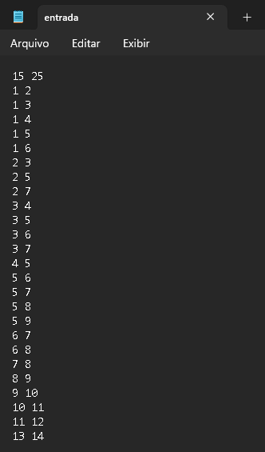
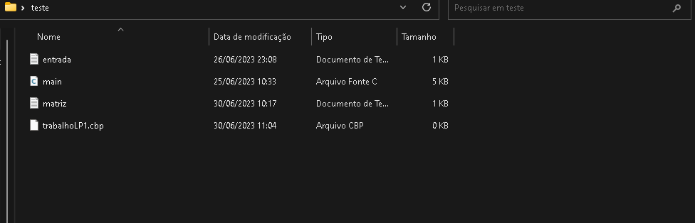
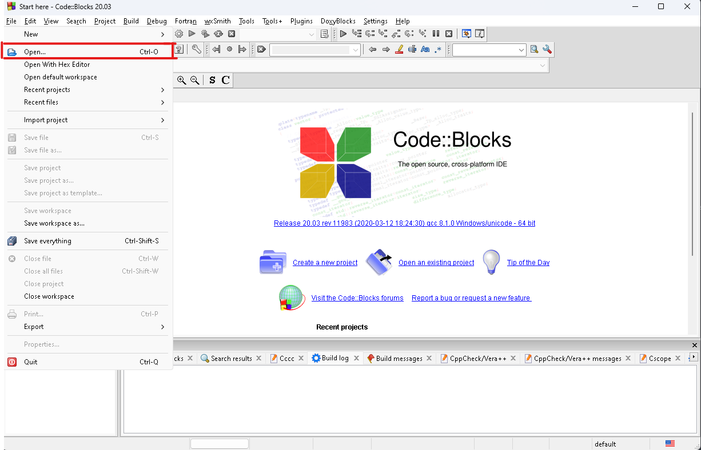
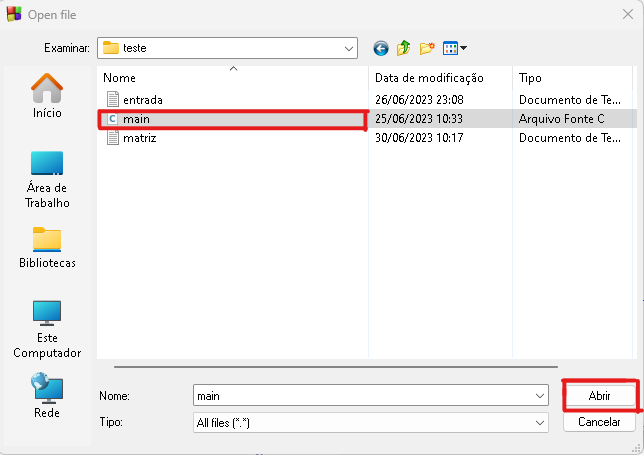

# Trabalho Final - Tema 4 - Linguagem de Programação 1
O trabalho é válido pela 3ª nota da disciplina de Linguagem de Progamação I e foi feito por Rodrigo Otávio, Therlyson Ryan, João Marcelo.
## Matriz de Conflitos - Introdução

Este código em C tem o objetivo de montar uma matriz de conflitos com base em um arquivo de entrada e realizar 2 análises a partir de disciplinas sorteadas.
As funções (montarGrade e montarGrade2) percorrem a matriz de conflitos (grade) a partir de um ponto de análise (número sorteado) e selecionam as disciplinas que podem ser adicionadas à grade sem conflitos. A diferença está na ordem de checagem:  
montarGrade: Pega o número sorteado e analisa até a última disciplina (análise crescente), e depois analisa a partir do número sorteado - 1, até a primeira disciplina (análise decrescente).  
montarGrade2:Pega o número sorteado e analisa até a última disciplina (análise crescente), e depois analisa a partir do primeiro termo até o número sorteado - 1 (análise crescente).

## Funcionalidades:
1. *montarMatriz* : Lê um arquivo de entrada contendo o número de disciplinas e conflitos entre elas. Em seguida, cria uma matriz de conflitos e a armazena em um arquivo chamado "matriz.txt".

2. *procurarConflitos*: Verifica se uma nova disciplina escolhida entra em conflito com as disciplinas já escolhidas anteriormente, com base na matriz de conflitos.

3. *montarGrade* e *montarGrade2*: A partir de uma posição de início de análise (decidida por sorteio) e da matriz de conflitos, seleciona as disciplinas que não têm conflitos com as disciplinas escolhidas anteriormente.

4. *montarGrade_imprime* e *montarGrade2_imprime*: Repetem a ação das funções montarGrade e montarGrade2 porém imprimem a análise feita na tela. Foram necessárias no código para implantarmos a lógica de otimizaçãopara retornar ao usuário apenas a análise com o maior número de disciplinas

5. *main*: A função principal do programa. Chama a função "montarMatrizConflitos" para gerar a matriz de conflitos. Em seguida, lê a matriz do arquivo "matriz.txt" e realiza 3 abordagens a partir 3 de disciplinas sorteadas, fazendo duas análises em cada, utilizando a função "montarGrade" e "montarGrade2", e escolhe a ideal".

## Tópicos utilizados em C

- Leitura e escrita de arquivos (`FILE`, `fopen`, `fclose`, `fscanf`, `fprintf`).
- Uso de bibliotecas.
- Utilização de matrizes.
- Uso de estruturas de decisão.
- Uso de estruturas de repetição.
- Uso de funções e passagem de parâmetros.
- Geração de números aleatórios (`srand`, `rand`).
- Structs (estruturas).
- Alocação Dinâmica.
- Recursividade.

## Como executar o programa no CodeBlocks:

1. Primeiramente, *modifique o arquivo "entrada.txt"* colocando nele um cénario (contendo os conflitos entre as disciplinas). Exemplo de cénario com 15 disciplinas x 25 conflitos:

2. É recomendado deixar esses *arquivos juntos na mesma pasta* (`main.c`, `entrada.txt`, `matriz.txt`)

3. Depois *abra o arquivo main.c* em algum ambiente de desenvolvimento (nesse caso o CodeBlocks)
    1. Vá em `File` e depois em `Open` 
     
    2. Ache a pasta que você colocou os arquivos e *selecione a `main.c`*
     
4. Rode o código
     

5. A saída esperada deve ser próxima a essa imagem a seguir:
 
