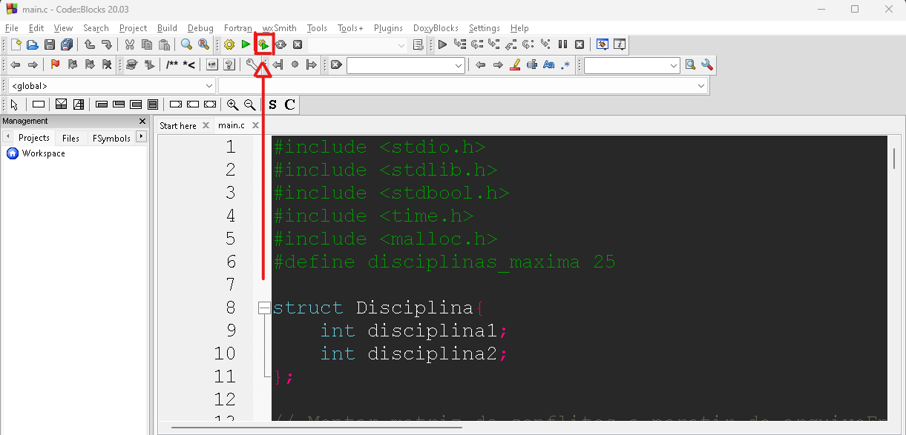

# Matriz de Conflitos - README

Este código em C tem o objetivo de montar uma matriz de conflitos com base em um arquivo de entrada e realizar análises a partir de disciplinas sorteadas.
O trabalho é válido pela 3ª nota da disciplina de Linguagem de Progamação I e foi feito por Rodrigo Otávio, Therlyson Ryan, João Marcelo.

## Funcionalidades

1. *montarMatrizConflitos*: Lê um arquivo de entrada contendo o número de disciplinas e conflitos entre elas. Em seguida, cria uma matriz de conflitos e a armazena em um arquivo chamado "matriz.txt".

2. *verificarConflitos*: Verifica se uma nova disciplina escolhida entra em conflito com as disciplinas já escolhidas anteriormente, com base na matriz de conflitos.

3. *montarGrade*: A partir de uma posição de início de análise (decidida por sorteio) e da matriz de conflitos, seleciona as disciplinas que não têm conflitos com as disciplinas escolhidas anteriormente.

4. *main*: A função principal do programa. Chama a função "montarMatrizConflitos" para gerar a matriz de conflitos. Em seguida, lê a matriz do arquivo "matriz.txt" e realiza 3 análises a partir de disciplinas sorteadas, utilizando a função "montarGrade".

## Tópicos utilizados em C

- Leitura e escrita de arquivos (`FILE`, `fopen`, `fclose`, `fscanf`, `fprintf`).
- Uso de bibliotecas.
- Utilização de matrizes.
- Uso de estruturas de decisão.
- Uso de estruturas de repetição.
- Uso de funções e passagem de parâmetros.
- Geração de números aleatórios (`srand`, `rand`).
- Structs (estruturas).
- Alocação Dinâmica.
- Recursividade.

## Como executar o programa no CodeBlocks:

1. Primeiramente, *modifique o arquivo "entrada.txt"* colocando nele um cénario (contendo os conflitos entre as disciplinas). Exemplo de cénario com 15 disciplinas x 25 conflitos:

2. É recomendado deixar esses *arquivos juntos na mesma pasta* ("main.c", "entrada.txt", "matriz.txt", "trabalhoLP1.cbp")

3. Depois *abra o arquivo main.c* em algum ambiente de desenvolvimento (nesse caso o CodeBlocks)
    1. Vá em "File" e depois em "Open"
     
    2. Ache a pasta que você colocou os arquivos e *selecione a main.c*
     
4. Rode o código
     

5. A saída esperada deve ser próxima a essa imagem a seguir:
